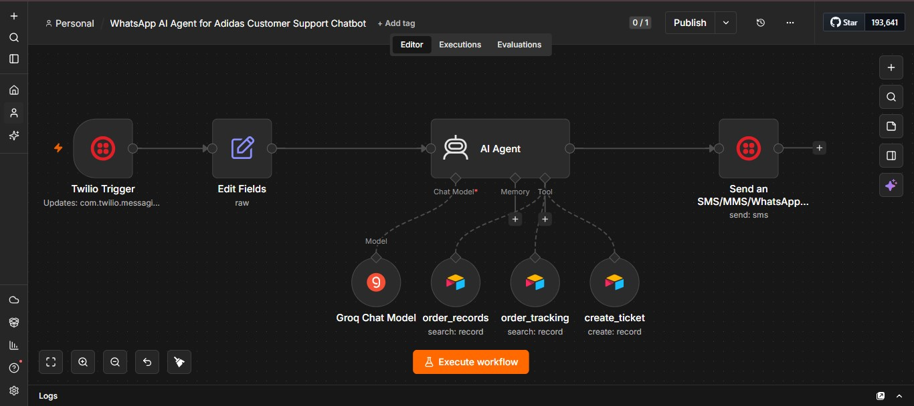

# 🤖 Adidas WhatsApp AI Agent — Customer Support Chatbot

> An intelligent, AI-powered WhatsApp customer support agent built for Adidas, capable of handling real-world customer queries including order tracking, inventory search, ticket creation, and returns — all through WhatsApp, with zero human intervention.

---

## 📌 Table of Contents

- [About the Project](#-about-the-project)
- [The Problem](#-the-problem)
- [The Solution](#-the-solution)
- [How I Built It](#-how-i-built-it)
- [Tech Stack](#-tech-stack)
- [Workflow Architecture](#-workflow-architecture)
- [Airtable Database Structure](#-airtable-database-structure)
- [Features & Functionalities](#-features--functionalities)
- [How It Works (Step by Step)](#-how-it-works-step-by-step)
- [Setup & Installation](#-setup--installation)
- [Build It Yourself — Complete Guide](#-build-it-yourself--complete-guide)
- [Environment Variables](#-environment-variables)
- [Return Policy Handled by Agent](#-return-policy-handled-by-agent)
- [Testing](#-testing)
- [Results](#-results)
- [Project Structure](#-project-structure)
- [Future Improvements](#-future-improvements)
- [Author](#-author)

---

## 📖 About the Project

The **Adidas WhatsApp AI Agent** is a fully automated, AI-powered customer support chatbot that handles real customer queries for Adidas directly through WhatsApp. Built using **n8n** (a workflow automation platform), **Groq's ultra-fast LLM (LLaMA 3.1)**, **Twilio's WhatsApp API**, and **Airtable** as a live database, this agent acts as a 24/7 virtual support representative.

Customers can simply send a WhatsApp message to get instant help — no waiting in queues, no hold music, no delays. The agent fetches **live data** from an Airtable database containing approximately **2500 dummy records** across 3 tables, ensuring every response is accurate and real-time.

---

## ❌ The Problem

Customer support is one of the biggest pain points for large retail brands like Adidas. Modern e-commerce brands receive **thousands of customer queries every day** through WhatsApp — the most widely used messaging platform in the world. Traditional support systems suffer from:

- 🕐 **Long response times** — customers wait hours or even days for replies
- 💸 **High operational costs** — requires a large team of support agents working 24/7
- ❌ **Human errors** — wrong order status, incorrect information given to customers
- 😞 **Poor customer experience** — frustrated customers abandon the brand
- 📂 **No ticket tracking** — complaints are lost or forgotten with no accountability
- 🌐 **No 24/7 availability** — support teams have working hours; customer problems do not

These queries typically include:
- *"Where is my order?"*
- *"Is this product available in size 10?"*
- *"What is your return policy?"*
- *"I want to raise a complaint."*

There was a clear need for an **intelligent, always-on, automated support system** that could handle these queries instantly using real live data — without any human intervention.

---

## ✅ The Solution

I built a **WhatsApp AI Agent** that:

- Receives customer messages on WhatsApp via **Twilio**
- Understands the query using **Groq AI (LLaMA 3.1 8B Instant)**
- Fetches **live data** from an **Airtable database** (Inventory, Orders, Tickets — ~2500 records)
- Generates an **intelligent, context-aware response**
- Sends the reply back to the customer on **WhatsApp** — all within seconds

The agent handles **3 core capabilities** automatically:
1. **Product/Inventory Queries** — checks stock and pricing in real time
2. **Order Tracking** — fetches live order status using order ID
3. **Support Ticket Creation** — logs complaints directly into the Airtable Tickets table

This is not a toy project or a learning exercise — it is designed to work in a production environment and deliver real business value.

---

## 🏗 How I Built It

The build process went through the following phases:

### Phase 1 — Planning
Identified the most common customer support request types for a retail brand like Adidas:
- Order tracking
- Product and inventory queries
- Support ticket creation
- Returns and refund handling

### Phase 2 — Designing the Workflow
Mapped out the agent flow before building:
```
Customer WhatsApp Message
        ↓
   Twilio Trigger
        ↓
   Edit Fields (format & inject return policy)
        ↓
   AI Agent (Groq LLaMA 3.1 with Tools)
        ↓
   Tool Selection:
   ├── order_records   → Inventory Table
   ├── order_tracking  → Orders Table
   └── create_ticket   → Tickets Table
        ↓
   Send WhatsApp Reply via Twilio
```

### Phase 3 — Building in n8n
- Set up the **Twilio Trigger** node to receive incoming WhatsApp messages
- Added an **Edit Fields** node to extract, format the customer's message, and inject the return policy
- Configured the **AI Agent** node with Groq as the language model and a system prompt defining its persona as an Adidas support agent
- Connected **three Airtable Tool nodes**: `order_records`, `order_tracking`, `create_ticket`
- Populated Airtable with approximately **2500 dummy records** across 3 tables
- Wired the final output back to Twilio to send the reply to the customer

### Phase 4 — Debugging & Iteration
- Ran multiple test executions, resolving errors across **6+ debug cycles**
- Fixed issues with data formatting, Airtable field name mismatches, tool routing, and API credentials
- Final version achieved a successful execution in **987ms**

---

## 🛠 Tech Stack

| Tool | Purpose |
|------|---------|
| **n8n** | Visual workflow automation platform — the backbone of the entire agent |
| **Groq (LLaMA 3.1 8B Instant)** | Ultra-fast AI language model powering the agent's responses |
| **Twilio** | WhatsApp Business API — receives and sends WhatsApp messages |
| **Airtable** | Live database with ~2500 dummy records across 3 tables (Inventory, Orders, Tickets) |
| **AI Agent Node** | n8n's built-in agent that routes queries to the right tools automatically |
| **Airtable Tool Nodes (×3)** | `order_records`, `order_tracking`, `create_ticket` — callable tools for the AI Agent |

---

## 🔄 Workflow Architecture



```
┌──────────────────────────────────────────────────────────────────┐
│                   ADIDAS WHATSAPP AI AGENT                        │
├──────────────────────────────────────────────────────────────────┤
│                                                                    │
│  [Twilio Trigger] → [Edit Fields] → [AI Agent] → [Send SMS]      │
│                           ↑              │                         │
│                     Formats raw     ┌────┴────┐                   │
│                    message +        │  Tools  │                   │
│                   return policy     │─────────│                   │
│                                     │order_   │                   │
│                                     │records  │ → Inventory Table │
│                                     │─────────│                   │
│                                     │order_   │                   │
│                                     │tracking │ → Orders Table    │
│                                     │─────────│                   │
│                                     │create_  │                   │
│                                     │ticket   │ → Tickets Table   │
│                                     └─────────┘                   │
│                       Model: Groq Chat Model (LLaMA 3.1)          │
└──────────────────────────────────────────────────────────────────┘
```

**Full message flow:**
```
Customer → WhatsApp → Twilio → n8n Trigger → Edit Fields
→ AI Agent → [Airtable Tool if needed] → AI Response → Twilio → Customer WhatsApp
```

---

## 🗄 Airtable Database Structure

The Airtable base named **"Adidas"** contains **3 tables** with approximately **2500 dummy records** total:

### 1. 📦 Inventory Table
Used by the `order_records` tool to answer product and stock queries.

| Field Name | Type | Description |
|---|---|---|
| `product_name` | Text | Name of the product |
| `product_price` | Number | Price of the product |
| `category` | Text | Shoe / Apparel / Accessories |
| `size` | Text | Available sizes |
| `stock_quantity` | Number | Units available in stock |

### 2. 🚚 Orders Table
Used by the `order_tracking` tool to fetch live order status.

| Field Name | Type | Description |
|---|---|---|
| `order_id` | Text | Unique order identifier |
| `customer_name` | Text | Name of the customer |
| `product_name` | Text | Product ordered |
| `order_status` | Text | Pending / Shipped / Delivered |
| `delivery_date` | Date | Expected delivery date |

### 3. 🎫 Tickets Table
Used by the `create_ticket` tool to log customer complaints.

| Field Name | Type | Description |
|---|---|---|
| `Name` | Text | Customer name / ticket title |
| `Notes` | Text | Description of the issue |
| `Assignee` | Text | Support agent assigned |
| `Status` | Options | Todo / In Progress / Done |

---

## ✅ Features & Functionalities

### 1. 🚚 Order Tracking
Customers can ask about the status of their orders. The agent queries the `order_tracking` tool using the order ID and returns real-time status updates.

**Example:**
> *"Where is my order #ADI-2024-5892?"*
> → *"Your order is currently out for delivery and will arrive by tomorrow."*

---

### 2. 📦 Inventory / Product Search
The agent can look up product availability, pricing, and sizes using the `order_records` tool connected to the Inventory table.

**Example:**
> *"Is Adidas Predator available in size 10?"*
> → Fetches live stock data and responds with availability and price.

---

### 3. 🎫 Support Ticket Creation
When an issue cannot be resolved automatically, the agent creates a support ticket via the `create_ticket` tool and confirms the ticket to the customer.

**Example:**
> *"My shoes arrived damaged."*
> → *"I've raised a support ticket for you. Our team will reach out within 24 hours."*

---

### 4. 💬 FAQ Answering
The AI agent handles common questions using its built-in system knowledge:
- Return and refund policies
- Sizing guides
- Delivery timelines
- Product availability
- Store information

---

### 5. 🔄 Returns & Refunds
Customers can ask about return eligibility and the agent guides them through the process using the embedded return policy in its system message.

---

### 6. 🧠 Context-Aware Responses
The AI Agent uses the Groq LLM to understand natural language — customers do not need to use specific commands or keywords. It understands intent and routes the query to the correct tool automatically.

---

## 🔁 How It Works (Step by Step)

1. **Customer sends a WhatsApp message** to the Adidas support number (powered by Twilio)
2. **Twilio Trigger** fires in n8n and captures the incoming message payload
3. **Edit Fields node** extracts the message body, formats it, and injects the Adidas return policy as context
4. **AI Agent** receives the formatted message and decides how to respond:
   - If it's a general/FAQ question → answers directly using the Groq LLM + system prompt
   - If product/inventory info is needed → calls `order_records` tool → queries Inventory table
   - If order status is needed → calls `order_tracking` tool → queries Orders table
   - If an issue needs escalation → calls `create_ticket` tool → creates record in Tickets table
5. **AI generates the response** using live Airtable data + LLM reasoning
6. **Response is sent back** to the customer via Twilio's WhatsApp API — within seconds

---

## ⚙️ Setup & Installation

### Prerequisites
- [n8n](https://n8n.io/) instance (self-hosted or cloud)
- [Twilio account](https://www.twilio.com/) with WhatsApp Business / Sandbox enabled
- [Groq API key](https://console.groq.com/)
- [Airtable account](https://airtable.com/) with the base and tables set up

### Steps

1. **Clone this repository**
```bash
git clone https://github.com/sagramanisahil/adidas-whatsapp-ai-agent.git
cd adidas-whatsapp-ai-agent
```

2. **Import the workflow into n8n**
   - Open your n8n instance
   - Go to **Workflows → Import from file**
   - Upload `WhatsApp AI Agent for Adidas Customer Support Chatbot.json`

3. **Add your credentials in n8n**
   - Twilio: Account SID + Auth Token
   - Groq: API Key
   - Airtable: Personal Access Token

4. **Configure your Twilio WhatsApp sandbox or production number**
   - Copy the Webhook URL from the Twilio Trigger node in n8n
   - Paste it in Twilio Console → WhatsApp Sandbox Settings → *"When a message comes in"*

5. **Update the Send Message node**
   - Set the `to` field to your WhatsApp number: `+92XXXXXXXXXX`

6. **Activate the workflow** in n8n by clicking **Publish**

---

## 🧰 Build It Yourself — Complete Guide

Follow these steps to replicate this project from scratch:

### Step 1 — Prepare Airtable

1. Go to [airtable.com](https://airtable.com) and create a new base called `Adidas`
2. Create 3 tables: `Inventory`, `Orders`, `Tickets`
3. Add fields exactly as shown in the [Airtable Database Structure](#-airtable-database-structure) section above
4. Add dummy data (minimum 10 records per table to test; 2500 recommended for production simulation)
5. Go to [airtable.com/create/tokens](https://airtable.com/create/tokens) and generate a **Personal Access Token** with:
   - `data.records:read`
   - `data.records:write`

---

### Step 2 — Set Up Twilio WhatsApp Sandbox

1. Go to [twilio.com](https://twilio.com) and create a free account
2. Navigate to **Messaging → Try it out → Send a WhatsApp message**
3. Follow the instructions to join the sandbox from your WhatsApp number (send the join code)
4. Go to **Account → API Keys** and note your **Account SID** and **Auth Token**
5. Note your sandbox number (usually `+14155238886`)

---

### Step 3 — Get Groq API Key

1. Go to [console.groq.com](https://console.groq.com)
2. Sign up or log in
3. Navigate to **API Keys → Create API Key**
4. Copy and save your key — it is shown only once

---

### Step 4 — Import Workflow in n8n

1. Open your n8n instance
2. Click **+ New Workflow**
3. Click the **three dots menu (⋯)** → **Import from file**
4. Upload: `WhatsApp AI Agent for Adidas Customer Support Chatbot.json`
5. The full workflow will appear with all nodes pre-configured

---

### Step 5 — Add Credentials in n8n

#### Twilio Credential
1. Click the **Twilio Trigger** node → Credentials → **Create New**
2. Enter your **Account SID** and **Auth Token** → Save

#### Groq Credential
1. Click the **Groq Chat Model** node → Credentials → **Create New**
2. Paste your **Groq API Key** → Save

#### Airtable Credential
1. Click any **Airtable Tool** node → Credentials → **Create New**
2. Paste your **Airtable Personal Access Token** → Save
3. This same credential works for all 3 Airtable tool nodes

---

### Step 6 — Update Node Settings

**In `Send an SMS/MMS/WhatsApp message` node:**
- Change the `to` field to your WhatsApp number: `+923XXXXXXXXX`

**In all 3 Airtable Tool nodes:**
- Re-select your **Adidas base** from the Base dropdown
- Re-select the correct **table** (Inventory / Orders / Tickets)
- Ensure field names in your Airtable match exactly what is used in the filter formulas

---

### Step 7 — Set Up Twilio Webhook

1. In n8n, click the **Twilio Trigger** node and copy the **Webhook URL**
2. Go to Twilio Console → WhatsApp Sandbox Settings
3. Paste the URL in the **"When a message comes in"** field
4. Save

---

### Step 8 — Test & Activate

1. Click **Execute Workflow** in n8n
2. Send a WhatsApp message to your Twilio sandbox number
3. Try these test messages:
   - `"What is your return policy?"`
   - `"Track my order ORD-1234"`
   - `"Is Adidas Predator available in size 9?"`
   - `"My package arrived damaged, I need help"`
4. Verify the AI responds correctly with live database data
5. Once satisfied, click **Publish** to activate 24/7

---

## 🔐 Environment Variables

When self-hosting n8n, create a `.env` file:

```env
TWILIO_ACCOUNT_SID=your_twilio_account_sid
TWILIO_AUTH_TOKEN=your_twilio_auth_token
TWILIO_WHATSAPP_NUMBER=whatsapp:+1XXXXXXXXXX
GROQ_API_KEY=your_groq_api_key
N8N_WEBHOOK_URL=https://your-n8n-instance.com/webhook/xxxx
AIRTABLE_PERSONAL_ACCESS_TOKEN=your_airtable_token
```

> ⚠️ **Never commit your `.env` file to GitHub.** Add it to `.gitignore`.

---

## 📋 Return Policy Handled by Agent

The AI Agent is pre-loaded with the following return policy inside its system message — so it can answer policy questions without calling any external tool:

> Adidas accepts returns within **30 days**. Items must be **unused with tags**. Defective items are returnable within **90 days**. Refund processed in **7 business days**. Contact **support@adidas.com** with your order ID to start a return.

This is also injected via the **Edit Fields** node so it is always available in the AI's context regardless of the query type.

---

## 🧪 Testing

The agent was tested across multiple real-world scenarios:

| Test Case | Input | Expected Output | Status |
|-----------|-------|-----------------|--------|
| Order tracking | *"Where is my order #1234?"* | Order status with delivery date | ✅ Pass |
| Inventory search | *"Is Predator available in size 10?"* | Stock and price from Airtable | ✅ Pass |
| FAQ — Return policy | *"Can I return my shoes?"* | Return policy explanation | ✅ Pass |
| Ticket creation | *"My package is missing"* | Ticket created in Airtable + confirmation | ✅ Pass |
| Returns initiation | *"I want to return my order"* | Step-by-step return process | ✅ Pass |
| General greeting | *"Hi, I need help"* | Friendly intro + offer to assist | ✅ Pass |

### Execution Performance
- Latest successful execution: **987ms**
- Workflow Version: **3**
- Execution ID: **#186**
- Total debug iterations before stable version: **6+**

---

## 📈 Results

- ⚡ Average response time: **under 1 second**
- 🤖 Handles **4 major support categories** fully autonomously
- 📱 Works natively on **WhatsApp** — no app download required for customers
- 🗄 Connected to **live Airtable database** (~2500 records) for real-time data
- 🔁 Fully **no-code/low-code** — built entirely in n8n
- 🌍 Available **24/7** with zero human intervention

---

## 📁 Project Structure

```
📂 adidas-whatsapp-ai-agent/
│
├── 📄 README.md                                                ← This file
├── 📄 WhatsApp AI Agent for Adidas Customer Support           ← n8n workflow JSON
│       Chatbot.json
├── 🖼️  N8N_Workflow.jpg                                        ← Workflow screenshot
└── 📄 .env.example                                             ← Environment variables template
```

---

## 🚀 Future Improvements

- [ ] Add product recommendation engine based on customer purchase history
- [ ] Integrate with Adidas's live inventory and ERP system
- [ ] Add multilingual support (Urdu, Arabic, French, etc.)
- [ ] Build a monitoring dashboard for ticket volumes and response times
- [ ] Add sentiment analysis to flag frustrated customers for human escalation
- [ ] Connect to a CRM (e.g., Salesforce or HubSpot) for full customer profiles
- [ ] Add voice message transcription support for WhatsApp voice notes
- [ ] Implement conversation memory across sessions for returning customers

---

## 👤 Author

**Sahil Kumar Sagramani**
- GitHub: [@sagramanisahil](https://github.com/sagramanisahil)
- LinkedIn: [sahil-kumar-sagramani](https://linkedin.com/in/sahil-kumar-sagramani)

---

> Built with ❤️ using **n8n · Groq AI · Twilio · Airtable** | Solving real customer support problems with AI automation
